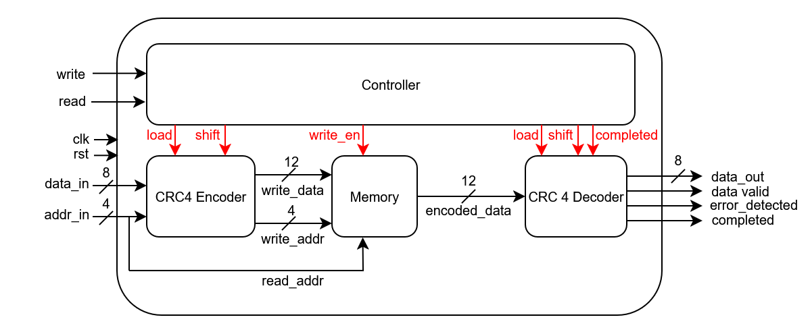
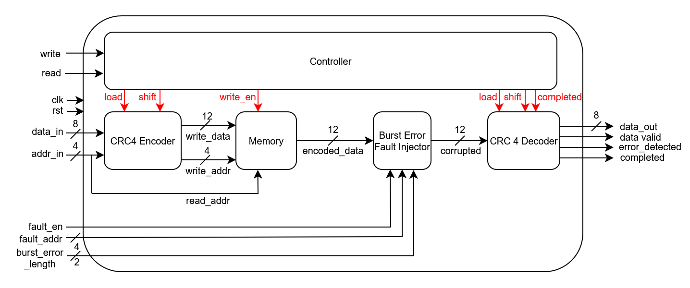
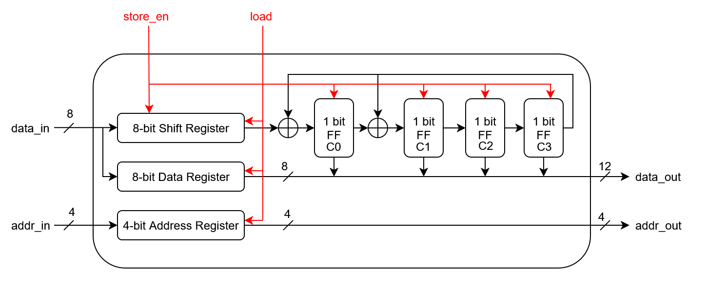
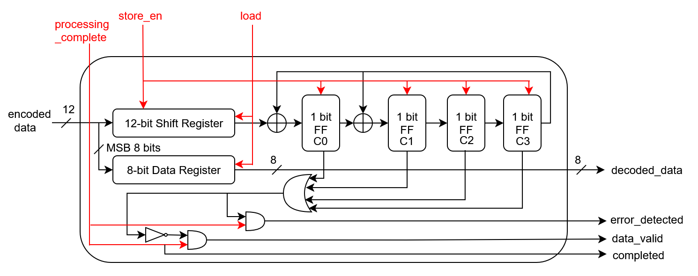
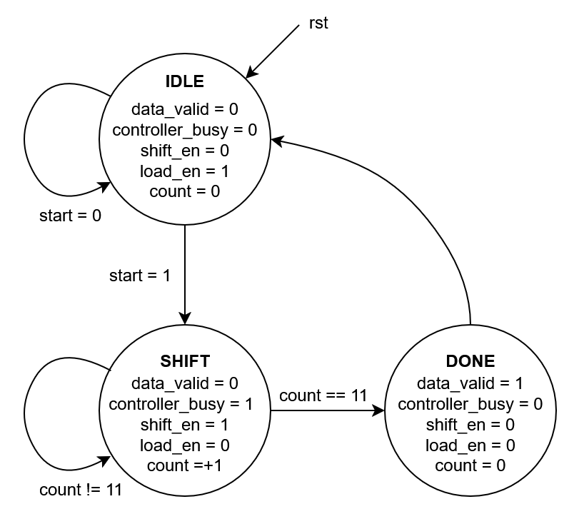
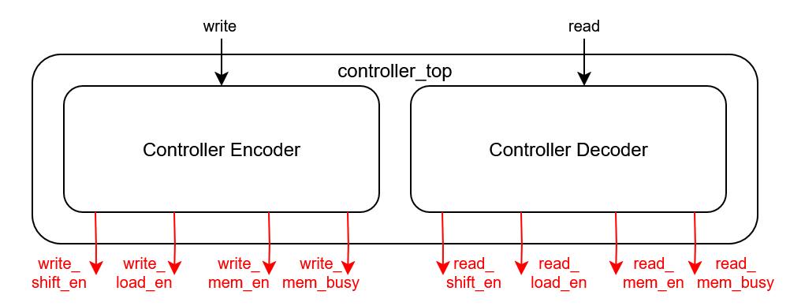

# 🧠 CRC-4 Code-Protected Memory System

This project implements a **CRC4 code** scheme for protecting memory from **single bit & upto 4-bit burst erors** in hardware using Verilog. It features:

* CRC4(12,8) encoding and decoding logic
* A simple memory model that stores encoded data
* A controller for encoding and decoding data
* A unidirectional fault injector to simulate bit-flips
* A decoder that can **detect single bit and upto 4-bit burst errors** (no correction)
* A comprehensive testbench for functional verification

---

## 📘 CRC Code: Overview

CRC codes are **single bit and burst errors detection codes**. They use a generator polynomial and an encoder/decoder built using LFSRs. They can detect upto n-bit burst error, where n is the degree of the polynomial.

We use the **CRC4(12,8)** configuration:

## 📏 CRC4 Code Basics:
Here a CRC4 code is implemented using the following generator polynomial:
`x^4 + x + 1`

Our generator polynomial has a degree of 4, hence it can detect upto 4 bit burst erros. The code is linear and seperable. It is made up of an encoding and decoding unit alongside a controller. The encoder and decoder is made using a LFSR.

### Parity Bit Positions (CRC4(12,8)):

| Bit Index | 11 | 10 | 9  | 8  | 7  | 6  | 5  | 4  | 3  | 2  | 1  | 0  |
| --------- | -- | -- | -- | -- | -- | -- | -- | -- | -- | -- | -- | -- |
| Contents  | D7 | D6 | D5 | D4 | D3 | D2 | D1 | D0 | C3 | C2 | C1 | C0 |

* `D0–D7`: Data bits
* `C3-C0`: Cyclic code bits representing the remainder (which we will discuss below)

---

## 📂 Project Structure

```
.
├── src/
│   └── cyclic_code/
│       ├── cyclic_code_encoder.v           # 8-bit to 12-bit CRC4 encoder
│       ├── cyclic_code_decoder.v           # Decoder with single bit and 4-bit burst error detection
│       ├── crc_code_faulty_memory.v        # Simple 12-bit memory model
│       ├── burst_error_injector.v          # Fault injector for single bit and 4-bit burst errors
│       ├── crc_code_controller.v           # Controller module that generates shift signals for LFSR
│       ├── crc_code_controller_top.v       # Controller Top: One for Encoder & one for decoder
│       ├── crc_code_memory.v               # Memory wrapper (normal)
│       └── crc_code_faulty_memory.v        # Memory wrapper with fault injection
│
├── tb/
│   └── crc_code_tb.v                       # Testbench with functional scenarios
│   └── crc_tb/
│       └── crc_controller_encoder_tb.v     # Testbench to test encoder + controller
│       └── crc_controller_tb.v             # Testbench to test controller functionality
│
├── images/
│   ├── crc_controller_fsm.png           # Diagram of controller fsm
│   ├── crc_code_memory.png              # Diagram of normal memory
│   └── crc_code_faulty_memory.png       # Diagram with burst error injection
│
└── README.md
```

---

## 🧠 Architecture Diagrams

### ✅ Berger Code Memory



### ✅ Berger Code Faulty Memory



---

## 🔩 Key Modules

### 🔹 `crc_code_encoder`

* Inputs: `input_data [7:0]`
          `addr_in [3:0]`
          `load`             -  Input from controller to load inital values in registers
          `shift_en`         -  Input from controller to shift LFSR
* Output: `output_code [11:0]`
          `addr_out [3:0]`
* Has an LSFR connected to a controller. It encodes the data in 12 cycles.



### 🔹 `crc_code_decoder`

* Inputs: `encoded_data [11:0]`
          `load`                -  Input from controller to load inital values in registers
          `shift_en`            -  Input from controller to shift LFSR
          `processing_complete` -  Input from controller to signal result is calculated
* Output: `decoded_data [7:0]`
          `data_valid`
          `error_detected`
          `completed`
* Has an LSFR connected to a controller. It decodes the data in 12 cycles.
* Completed goes to 1 for one cycle, and at the same time either data_valid or error_detected goes to 1.



### 🔹 `crc_code_controller`

* When start signal is asserted, it performs shift operations for 12 cycles for the LFSRs. The FSM is given below



### 🔹 `crc_code_controller_top`

* Has 2 instances of crc_code_controller. One is for the encoder and one for the decoder. 
* The same controller can not be used because both encoder and decoder may be working at the same time.



### 🔹 `mem_crc_code`

* Synchronous memory module storing 12-bit CRC4 codewords.

### 🔹 `burst_error_injector`

* Injects single bit and upto 4 bit burst error.

### 🔹 `crc_code_memory`

* Top-level module: controller + encoder + memory + decoder without fault injection.

### 🔹 `crc_code_faulty_memory`

* Includes `burst_error_injector` fault injector before decoder.

---

## ✅ Features Tested

* Store and retrieve 8-bit values
* Simulate single bit fault on any bit in the 12-bit codeword
* Simulate 2/3/4 bit burst error in the 12-bit codeword
* Verify correction logic works as expected
* Waveform-based verification
* Latch-free and synthesizable logic

---

## 🚀 Future Extensions

* Optimize to perform lsfr computation in less cycles
* Add BCH alternatives
* Formal verification with SystemVerilog Assertions
* Use parameterized width memory for generality

---

## 🛠️ Usage (Vivado)

1. Open Vivado and create a new project
2. Add all files from `src/crc_code/` as sources
3. Add `crc_code_tb.v` from `tb/` as simulation source
4. Run simulation to observe error detection behavior with/without faults
5. Use waveform viewer to analyze encoding, fault injection, and detection signals

---

## 📜 License

Licensed under the **MIT License** – free to use, modify, and distribute.

---

## 🤝 Contributions

Pull requests, feature additions, and bug reports are welcome.
Let me know if you'd like to contribute diagrams, testbenches, or extensions!
