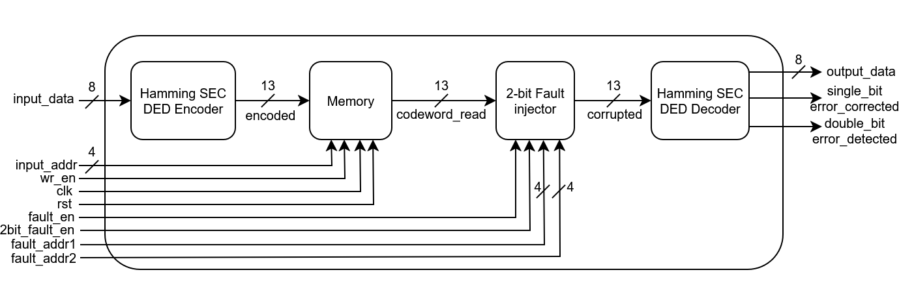

# 🧠 Hamming SEC DED-Protected Memory System

This project implements a **Hamming SEC DED (Single Error Correction, Double Error Detection)** scheme for protecting memory from 1-bit & 2-bit faults in hardware using Verilog. It features:

* Hamming(13,8) encoding and decoding logic
* A simple memory model that stores encoded data
* A fault injector to simulate bit-flips
* A decoder that can **detect and correct** single-bit errors
* A decoder that can **detect** double-bit errors
* A comprehensive testbench for functional verification

---

## 📘 Hamming SEC DED Code: Overview

Hamming codes are linear error-correcting codes that add redundant bits (parity bits) to data bits to allow detection and correction of single-bit errors.

We use the **Hamming(13,8)** configuration:

### Parity Bit Positions (Hamming(13,8)):

| Bit Index | 12 | 11 | 10 | 9  | 8  | 7  | 6  | 5  | 4  | 3  | 2  | 1  | 0  |
| --------- | -- | -- | -- | -- | -- | -- | -- | -- | -- | -- | -- | -- | -- |
| Contents  | D7 | D6 | D5 | P8 | D4 | D3 | D2 | P4 | D1 | D0 | P2 | P1 | P0 |

* `D0–D7`: Data bits
* `P1, P2, P4, P8`: Parity bits calculated from subsets of data bits
* `P0`: Overall parity bit for Single Error Correction, Double Error Detection (SEC-DED)

---

## 🧮 Syndrome Table

During decoding, the syndrome is calculated using the parity-check matrix. The value of the syndrome corresponds to the index of the flipped bit (if any):

| Syndrome | Error Bit Index | Description           |
| -------- | --------------- | --------------------- |
| `0000`   | –               | No error              |
| `0001`   | 0               | Bit 0 (P1) corrupted  |
| `0010`   | 1               | Bit 1 (P2) corrupted  |
| `0011`   | 2               | Bit 2 (D0) corrupted  |
| `0100`   | 3               | Bit 3 (P4) corrupted  |
| `0101`   | 4               | Bit 4 (D1) corrupted  |
| `0110`   | 5               | Bit 5 (D2) corrupted  |
| `0111`   | 6               | Bit 6 (D3) corrupted  |
| `1000`   | 7               | Bit 7 (P8) corrupted  |
| `1001`   | 8               | Bit 8 (D4) corrupted  |
| `1010`   | 9               | Bit 9 (D5) corrupted  |
| `1011`   | 10              | Bit 10 (D6) corrupted |
| `1100`   | 11              | Bit 11 (D7) corrupted |

* If syndrome ≠ 0000 and overall parity (P0) incorrect, it's a single-bit error — correctable.
* If syndrome ≠ 0000 but P0 is correct, it's a double-bit error — detectable only.
* If syndrome = 0000 but P0 is incorrect, it's a error in the parity bit — correctable.

---

## 📂 Project Structure

```
.
├── src/
│   └── hamming_sec_ded/
│       ├── hamming_secded_encoder.v           # 8-bit to 13-bit Hamming encoder
│       ├── hamming_secded_decoder.v           # Decoder with single-bit correction & double-bit detection
│       ├── mem_secded.v                       # Simple 13-bit memory model
│       ├── two_bit_fault_injector.v           # Fault injector for single and double-bit flip
│       ├── ecc_hamming_secded_memory.v        # ECC memory (normal)
│       └── ecc_hamming_secded_faulty_memory.v # ECC memory with fault injection
│
├── tb/
│   └── hamming_secded_tb.v                    # Testbench with functional scenarios
│
├── images/
│   ├── ecc_hamming_secded_diagram.png         # Diagram of normal ECC memory
│   └── ecc_hamming_secded_faulty_diagram.png  # Diagram with fault injection
│
└── README.md
```

---

## 🧠 Architecture Diagrams

### ✅ ECC Hamming SEC DED Memory


### ✅ ECC Hamming SEC DED Faulty Memory



---

## 🔩 Key Modules

### 🔹 `hamming_secded_encoder`

* Inputs: `input_data [7:0]`
* Output: `output_code [12:0]`
* Encodes data using Hamming logic and generates 5 parity bits.

### 🔹 `hamming_secded_decoder`

* Inputs: `in_code [12:0]`
* Outputs: `out_data [7:0]`, `error_corrected`
* Computes syndrome and detects single & double bit errors and corrects single bit errors.

### 🔹 `mem_secded`

* Synchronous memory storing 13-bit Hamming codewords.

### 🔹 `two_bit_fault_injector`

* Injects a single-bit error (or double-bit error depending on `is_two_bit_fault`) at the specified position when `fault_en` is high.

### 🔹 `ecc_hamming_secded_memory`

* Top-level wrapper for encoder, memory, and decoder (no fault injection).

### 🔹 `ecc_hamming_secded_faulty_memory`

* Includes fault injector before passing to decoder.
---

## ✅ Features Tested

* Store and retrieve 8-bit values
* Simulate 1-bit/2-bit faults on any bit in the 13-bit codeword
* Corrects Single bit error
* Verify correction logic works as expected
* Waveform-based verification
* Latch-free and synthesizable logic

---

## 🚀 Future Extensions

* Add CRC, BCH, or Berger code alternatives
* Formal verification with SystemVerilog Assertions
* Use parameterized width memory for generality

---

## 🛠️ Usage (Vivado)

1. Open Vivado and create a new project
2. Add all files from `src/hamming_sec_ded/` as sources
3. Add `hamming_secded_tb.v` from `tb/` as simulation source
4. Run simulation to observe correction behavior
5. Optionally, use waveform viewer to inspect correction

---

## 📜 License

Licensed under the **MIT License** – free to use, modify, and distribute.

---

## 🤝 Contributions

Pull requests, feature additions, and bug reports are welcome.
Let me know if you'd like to contribute diagrams, testbenches, or extensions!

