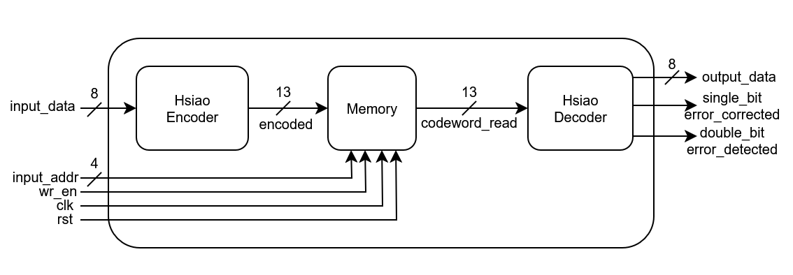
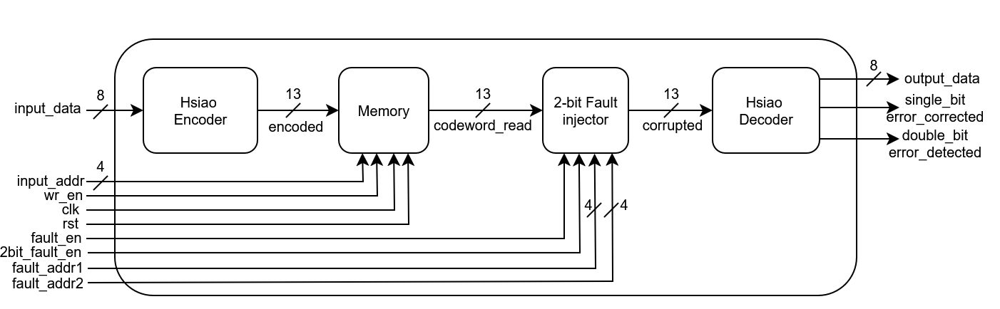
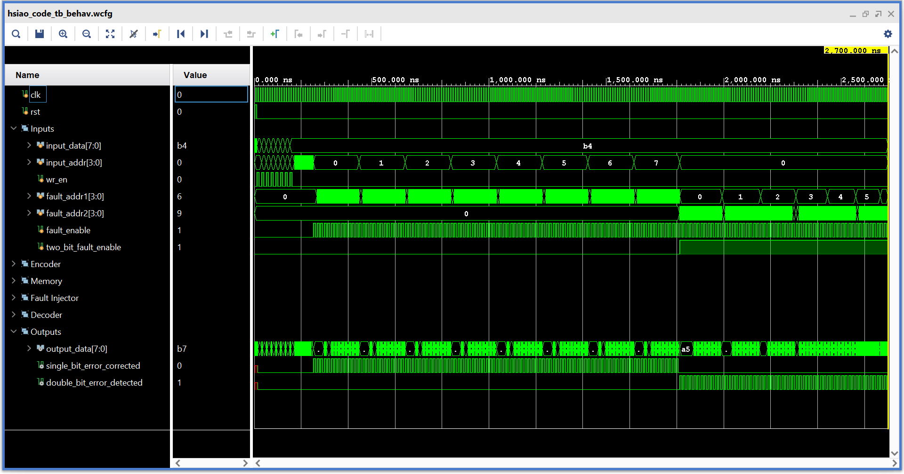

# 🧠 Hsiao SEC DED-Protected Memory System

This project implements a **Hsiao SEC DED (Single Error Correction, Double Error Detection)** scheme for protecting memory from 1-bit & 2-bit faults in hardware using Verilog. It features:

* Hsiao(13,8) encoding and decoding logic
* A simple memory model that stores encoded data
* A fault injector to simulate bit-flips
* A decoder that can **detect and correct** single-bit errors
* A decoder that can **detect** double-bit errors
* A comprehensive testbench for functional verification

---

## 📘 Hsiao SEC DED Code: Overview

Hsiao codes are error-correcting codes that add redundant bits (parity bits) to data bits to allow detection and correction of single-bit errors. They use syndromes with only odd number of 1's for constructing the check matrix. Double bit erros lead to a syndrome with even number of 1's which allows detection. 

We use the **Hsiao(13,8)** configuration:

## 📏 Hsiao SEC DED Code Bit Calculation

Hsiao Code use half the number of possible bit combinations for constructing syndromes. For a code word, we can use the following formula to get the number of check bits
`p = ceil(log2(p + d)) + 1`

Where:
- `d` = number of data bits
- `p` = number of hsiao code bits

In our example we have d = 8. Solving the above equation we get a value of p = 5.

### Parity Bit Positions (Hsiao(13,8)):

| Bit Index | 12 | 11 | 10 | 9  | 8  | 7  | 6  | 5  | 4  | 3  | 2  | 1  | 0  |
| --------- | -- | -- | -- | -- | -- | -- | -- | -- | -- | -- | -- | -- | -- |
| Contents  | D7 | D6 | D5 | D4 | D3 | D2 | D1 | D0 | P4 | P3 | P2 | P1 | P0 |

* `D0–D7`: Data bits
* `P0-P4`: Parity bits calculated from subsets of data bits

---

## 🧮 Syndrome Table

During decoding, the syndrome is calculated using the parity-check matrix. The value of the syndrome corresponds to the index of the flipped bit (if any):

| Syndrome | Error Bit Index | Description           |
| -------- | --------------- | --------------------- |
| `00000`  | –               | No error              |
| `00001`  | 0               | Bit 0 (P0) corrupted  |
| `00010`  | 1               | Bit 1 (P1) corrupted  |
| `00100`  | 2               | Bit 2 (P2) corrupted  |
| `01000`  | 3               | Bit 3 (P3) corrupted  |
| `10000`  | 4               | Bit 4 (P4) corrupted  |
| `00111`  | 5               | Bit 5 (D0) corrupted  |
| `01110`  | 6               | Bit 6 (D1) corrupted  |
| `01101`  | 7               | Bit 7 (D2) corrupted  |
| `01011`  | 8               | Bit 8 (D3) corrupted  |
| `10011`  | 9               | Bit 9 (D4) corrupted  |
| `10101`  | 10              | Bit 10 (D5) corrupted |
| `10110`  | 11              | Bit 11 (D6) corrupted |
| `11001`  | 12              | Bit 12 (D7) corrupted |

* If syndrome = 00000, it means there is no error.
* If syndrome ≠ 00000 and number of 1's in syndrome is odd, it is a single bit error — correctable.
* If syndrome ≠ 00000 and number of 1's in syndrome is even, it is a double bit error — detectable.

---

## 📂 Project Structure

```
.
├── src/
│   └── hsiao_code/
│       ├── hsiao_code_encoder.v               # 8-bit to 13-bit Hsiao encoder
│       ├── hsiao_code_decoder.v               # Decoder with single-bit correction & double-bit detection
│       ├── mem_hsiao_code.v                   # Simple 13-bit memory model
│       ├── two_bit_fault_injector.v           # Fault injector for single and double-bit flip
│       ├── hsiao_code_memory.v                # ECC memory (normal)
│       └── hsiao_code_faulty_memory.v         # ECC memory with fault injection
│
├── tb/
│   └── hsiao_code_tb.v                        # Testbench with functional scenarios
│
├── images/
│   ├── hsiao_code_diagram.png                 # Diagram of normal ECC memory
│   └── hsiao_code_faulty_diagram.png          # Diagram with fault injection
│
└── README.md
```

---

## 🧠 Architecture Diagrams

### ✅ ECC Hsiao SEC DED Memory



### ✅ ECC Hsiao SEC DED Faulty Memory



---

## 🔩 Key Modules

### 🔹 `hsiao_code_encoder`

* Inputs: `input_data [7:0]`
* Output: `output_code [12:0]`
* Encodes data using Hsiao logic and generates 5 parity bits.

### 🔹 `hsiao_code_decoder`

* Inputs: `in_code [12:0]`
* Outputs: `out_data [7:0]`, `single_error_corrected`, `double_error_detected`
* Computes syndrome and detects single & double bit errors and corrects single bit errors.

### 🔹 `mem_hsiao_code`

* Synchronous memory storing 13-bit Hsiao codewords.

### 🔹 `two_bit_fault_injector`

* Injects a single-bit error (or double-bit error depending on `is_two_bit_fault`) at the specified position when `fault_en` is high.

### 🔹 `hsiao_code_memory`

* Top-level wrapper for encoder, memory, and decoder (no fault injection).

### 🔹 `hsiao_code_faulty_memory`

* Includes fault injector before passing to decoder.
---

## 📊 Simulation

The performance of the code can be verified from the simulation below:



---

## ✅ Features Tested

* Store and retrieve 8-bit values
* Simulate 1-bit/2-bit faults on any bit in the 13-bit codeword
* Corrects Single bit error
* Verify correction logic works as expected
* Waveform-based verification
* Latch-free and synthesizable logic

---

## 🚀 Future Extensions

* Add CRC or BCH code alternatives
* Formal verification with SystemVerilog Assertions
* Use parameterized width memory for generality

---

## 🛠️ Usage (Vivado)

1. Open Vivado and create a new project
2. Add all files from `src/hsiao_code/` as sources
3. Add `hsiao_code_tb.v` from `tb/` as simulation source
4. Run simulation to observe correction behavior
5. Optionally, use waveform viewer to inspect correction

---

## 📜 License

Licensed under the **MIT License** – free to use, modify, and distribute.

---

## 🤝 Contributions

Pull requests, feature additions, and bug reports are welcome.
Let me know if you'd like to contribute diagrams, testbenches, or extensions!

